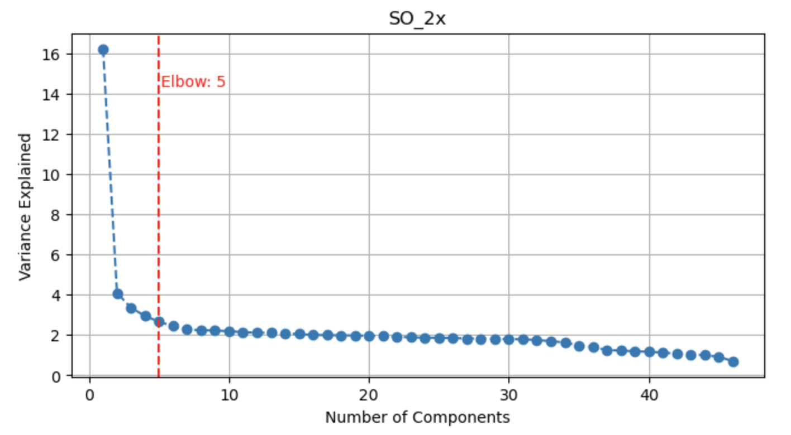
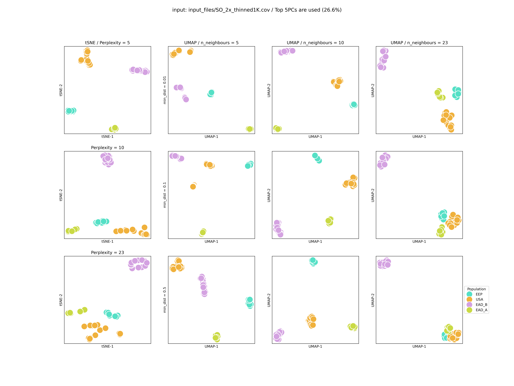

- [Getting Started](#Getting-Started)
  * [Installing Jupyter Notebook](#Installing-Jupyter-Notebook)
- [Tutorial](#Tutorial)
  * [Generating Input Files](#Generating-Input-Files)
    + [Estimation of Genotype Likelihoods](#Estimation-of-Genotype-Likelihoods)
    + [Principal Component Analysis using Genotype Likelihoods](#Principal-Component-Analysis-using-Genotype-Likelihoods)
    + [Important Points to Consider](#Important-Points-to-Consider)
  * [Running t-SNE and UMAP with the Principal Components of Genotype Likelihoods](#Running-t-SNE-and-UMAP-with-the-Principal-Components-of-Genotype-Likelihoods)
     + [Loading Required Libraries](#Loading-Required-Libraries)
     + [Creating Color Palette for Different Populations](#Creating-Color-Palette-for-Different-Populations)
     + [Loading the Population Data and Covariance Matrix](#Loading-the-Population-Data-and-Covariance-Matrix)
     + [Performing Elbow Method for the Selection of Principal Components](#Performing-Elbow-Method-for-the-Selection-of-Principal-Components)
     + [Performing t-SNE and UMAP with a Grid Search](#Performing-t-SNE-and-UMAP-with-a-Grid-Search)
     + [Visualizing the Results](#Visualizing-the-Results)
  * [t-SNE and UMAP without PCA Initialization](#t-SNE-and-UMAP-without-PCA-Initialization)
 - [Citation](#Citation)

    
Getting Started
===========================================
This repository includes the input files and code used in Çilingir et al. (n.d) Additionally, you'll find a tutorial on using genotype likelihoods in non-linear dimensionality reduction techniques for analyzing population genetic structure. If you find the tutorial helpful, please cite our paper as indicated in the [Citation](#Citation) section below.

Installing Jupyter Notebook
------------------------

We recommend [installing Conda](https://conda.io/projects/conda/en/latest/user-guide/install/index.html) and creating a conda environment that includes the necessary packages to run the Jupyter Notebook and perform the subsequent analysis outlined in the following tutorial.

For reproducibility, we provide the file required to build the Conda environment to perform our analyses. You can create a Conda environment with [this file](environment/lcUMAPtSNE.yml):
  
```bash
conda env create -f lcUMAPtSNE.yml
```

See [Managing Environments in Conda](https://conda.io/projects/conda/en/latest/user-guide/tasks/manage-environments.html#) for more details.

See [Running the Notebook](https://docs.jupyter.org/en/latest/running.html#running) for more details.

Tutorial
===========================================

Generating Input Files
------------------------
### Estimation of Genotype Likelihoods
In this tutorial, we will use SO_2x dataset mentioned in Çilingir et al. (n.d.) and explain related analysis steps for a single input file. 

In our study, we used the raw data of [Humble et al. (2023)](https://www.pnas.org/doi/full/10.1073/pnas.2210756120) and mirrored their genotype-likelihood estimation and PCA.

First we estimated genotype-likelihoods with [ANGSD](https://www.popgen.dk/angsd/index.php/ANGSD).

```bash
$angsd -P 1 -bam bams.list -ref $REF -rf chrs.list -out SO_2x -uniqueOnly 1 -remove_bads 1 -only_proper_pairs 1 -trim 0 -minQ 30 -minMapQ 30 -minMaf 0.01 -minInd 30 -GL 2 -doMajorMinor 1 -doMaf 1 -skipTriallelic 1 -SNP_pval 1e-6 -doGlf 2
```

We then used the variant site positions in the resulting "SO_2x.mafs" file and performed thinning with a [custom script](codes/thin.sh). Afterward, we ran ANGSD again with these [sites](https://www.popgen.dk/angsd/index.php/Sites).

### Principal Component Analysis using Genotype Likelihoods

We ran PCA with [PCAngsd](https://www.popgen.dk/software/index.php/PCAngsd):

```bash
pcangsd -b SO_2x_thinned1K.beagle.gz -o SO_2x_thinned1K"
```

### Important Points to Consider
It's important to acknowledge that PCA can be influenced by various factors, including the relatedness between samples, uneven representation of each sampled hypothetical population, data missingness, the presence of rare SNPs, and the correlation of genetic markers due to linkage disequilibrium.
Therefore, it's essential to select appropriate settings within ANGSD and PCAngsd. For further insight into parameter settings for genotype-likelihood-based analysis, we recommend referring to this guideline: [Lou et al. 2021](https://onlinelibrary.wiley.com/doi/full/10.1111/mec.16077?casa_token=EXTKRj6uH_EAAAAA%3AaQrZ14Y7Oxem05HpoucBqBoiJqQ8SjRn5WPdt0UC6fiwsoB8OsL55kN01PyeOriFAxL48EeGy-nyc02o).

Running t-SNE and UMAP with the Principal Components of Genotype Likelihoods
------------------------
### Loading Required Libraries
In the following sections we will go over a single input covariance matrix obtained with (SO_2x), the output of PCAngsd.

For the corresponding Jupyter Notebook refer to [SO_singleCov_GridSearch.ipynb](codes/jupyter_notebooks/SO_singleCov_GridSearch.ipynb). For running subsequent analyses with multiple covariance matrices you can refer to [SO_multiCov_GridSearch.ipynb](codes/jupyter_notebooks/SO_multiCov_GridSearch.ipynb)

Now we need to activate the conda environment (lcUMAPtSNE):

```bash
conda activate lcUMAPtSNE
```

Next, we need to initiate the Jupyter Notebook:

```bash
jupyter notebook path/to/SO_singleCov_GridSearch.ipynb
```

Then, a browser window will be opened. From there we will select the conda environment we created as a kernel:


In this Jupyter Notebook the first code block is for loading required libraries:

```python
# Import necessary libraries for data curation, visualization, and dimensionality reduction.
import numpy as np
import pandas as pd
import seaborn as sns
import matplotlib.pyplot as plt
from kneed import KneeLocator
from sklearn.decomposition import PCA as PCA
from sklearn.manifold import TSNE
import umap 
```

### Creating Color Palette for Different Populations

To ensure accessibility in visual data representation, we used a color palette generated by the online tool [I Want Hue](https://medialab.github.io/iwanthue/).

```python
# Define a custom color palette for visualizing different populations in the Oryx datasets.
custom_palette = {
    "EAD_A": "#cada45",  # Green
    "EAD_B": "#d4a2e1",  # Purple
    "EEP": "#55e0c6",    # Blue
    "USA": "#f0b13c",    # Orange
}
```

### Loading the Population Data and Covariance Matrix

Covariance matrix and population data for Oryx samples are loaded:

```python
# Load population data and covariance matrix from specified files.
filename = 'input_files/SO_2x_thinned1K.cov'
population_names = pd.read_csv('input_files/oryx_pop_info.txt', sep='\t', header=0)
cov_mat = pd.read_csv(filename, sep=' ', header=None)

# Prepare a dataframe to store the analysis results.
Data_Struct = population_names
```

### Performing Elbow Method for the Selection of Principal Components

First the functions to calculate the 'elbow point' (using _kneed_, [Satopaa et al., 2011](https://github.com/arvkevi/kneed/tree/v0.8.5)) and scree plot functions are defined:

```python
# Define a function to plot the scree plot, which helps in determining the number of principal components to retain.
def plot_scree(explained_variance, filename_title, elbow_point):
    plt.figure(figsize=(8, 4))
    explained_variance = list(explained_variance)
    plt.plot(range(1, len(explained_variance) + 1), explained_variance, marker='o', linestyle='--')
    plt.axvline(x=elbow_point, color='r', linestyle='--')
    plt.text(elbow_point + 0.1, max(explained_variance) * 0.9, f'Elbow point: {elbow_point}', color='red', verticalalignment='center')
    plt.title(f'{filename_title}')
    plt.xlabel('Number of Components')
    plt.ylabel('Variance Explained')
    plt.grid()
    plt.show()

# Define a function to find the elbow point in the scree plot.
def find_elbow_point(explained_variance, sensitivity=1.0):
    explained_variance = list(explained_variance)
    kneedle = KneeLocator(range(1, len(explained_variance) + 1), explained_variance, curve='convex', direction='decreasing', S=sensitivity, interp_method='polynomial')
    return kneedle.elbow
```
Next, the decomposition of the covariance matrix is performed and principal components are selected and sorted:

```python
# Convert the covariance matrix to a numpy array and calculate eigenvalues and eigenvectors.
cov_mat_np = cov_mat.to_numpy()
eigen_vals, eigen_vecs = np.linalg.eig(cov_mat_np)
eigen_pairs = [(np.abs(eigen_vals[i]), eigen_vecs[:, i]) for i in range(len(eigen_vals))]
eigen_pairs.sort(key=lambda k: k[0], reverse=True)

# Select principal components based on sorted eigenvalues.
feature_vector = np.hstack([eigen_pairs[i][1][:, np.newaxis] for i in range(len(eigen_vals))])
principal_components = cov_mat_np.dot(feature_vector) 

# Sort eigenvalues and eigenvectors, calculate explained variance.
idx = eigen_vals.argsort()[::-1]   
eigenValues = eigen_vals[idx]
eigenVectors = eigen_vecs[:,idx]
expl_pre = eigenValues / sum(eigenValues)
expl = np.cumsum(expl_pre)
expl_df = pd.DataFrame(expl_pre * 100, columns=['explained_variance'])
expl_df['cumulative_expl'] = expl * 100
expl_df.set_index(np.arange(1, eigenVectors.shape[0] + 1), inplace=True)
```
Finally, elbow point is calculated and plotted together with the scree plot:

```python
# Plot the scree plot and find the elbow point for optimal PCA components.
elbow_point = find_elbow_point(expl_df['explained_variance'])
print("Optimal number of principal components):", elbow_point)
plot_scree(expl_df['explained_variance'], 'SO_2x', elbow_point)
```



### Performing t-SNE and UMAP with a Grid Search
Using the number of PCs with the elbow method, t-SNE and UMAP is performed with a combination of parameters (Grid search).

First, the parameters are defined:
```python
# Set the "optimal" number of principal components to use for t-SNE and UMAP.
n_pc = elbow_point

# Define parameter ranges for t-SNE.
# We set the maximum to be half of the number of individuals in the dataset.
# We set the minimum to be the smallest number of individuals in given populations.
# We then took a middle value between the min and max.
perplexity_values = (5, 10, 23)

# Define parameter ranges for UMAP.
# Default value is 0.1.
mindists = (0.01, 0.1, 0.5)

# We set the maximum to be half of the number of individuals in the dataset.
# We set the minimum to be the smallest number of individuals in given populations.
# We then took a middle value between the min and max.
n_neighbors_nums = (5, 10, 23)
```
Next, t-SNE and UMAP are performed:

```python
# Perform t-SNE.
for perp in perplexity_values:
    np.random.seed(88)
    proj_tsne = TSNE(n_components=2, perplexity=perp).fit_transform(principal_components[:, :n_pc])
    Data_Struct[f'tSNE-1 perp{perp}'] = proj_tsne[:, 0]
    Data_Struct[f'tSNE-2 perp{perp}'] = proj_tsne[:, 1]
    
# Perform UMAP.
for nn in n_neighbors_nums:
    for mind in mindists:
        np.random.seed(88)
        proj_umap = umap.UMAP(n_components=2, n_neighbors=nn, min_dist=mind).fit_transform(principal_components[:, :n_pc])
        Data_Struct[f'UMAP-1 numn{nn} mindist{mind}'] = proj_umap[:, 0]
        Data_Struct[f'UMAP-2 numn{nn} mindist{mind}'] = proj_umap[:, 1]
```

### Visualizing the Results
Finally, the results are visualized:
```python
# Ensure the lengths of perplexity_values and mindists are equal - only for visualisation purposes.
if len(perplexity_values) != len(mindists):
    raise ValueError("The number of perplexity values must be equal to the number of minimum distance values.")

# Prepare and plot the final visualizations for both t-SNE and UMAP.
n_rows = len(perplexity_values)
n_cols = 1 + len(n_neighbors_nums)  # Adding one column for t-SNE and the rest for UMAP.
fig, axs = plt.subplots(n_rows, n_cols, figsize=(5 * n_cols, 5 * n_rows))
fig.suptitle(f"input: {filename} / Top {n_pc}PCs are used ({round(expl_df['cumulative_expl'][n_pc-1], 1)}%)", fontsize=14)

# Generate plots for t-SNE and UMAP, adjusting labels and legends appropriately.
# t-SNE plots (first column)
for i, perp in enumerate(perplexity_values):
    sns.scatterplot(ax=axs[i, 0], data=Data_Struct, x='tSNE-1 perp' + str(perp), y='tSNE-2 perp' + str(perp), s=300, hue='Population', palette=custom_palette, legend=False)
    axs[i, 0].set_xlabel('tSNE-1')
    axs[i, 0].set_ylabel('tSNE-2')
    axs[i, 0].set_xticks([])
    axs[i, 0].set_yticks([])
    # Set the title differently for the first plot
    if i == 0:
        axs[i, 0].set_title('tSNE / Perplexity = ' + str(perp))
    else:
        axs[i, 0].set_title('Perplexity = ' + str(perp))


# UMAP plots (next columns)
for j, nn in enumerate(n_neighbors_nums):
    for i, mind in enumerate(mindists):
        is_last_plot = (i == len(mindists) - 1) and (j == len(n_neighbors_nums) - 1)
        sns.scatterplot(ax=axs[i, j + 1], data=Data_Struct, x='UMAP-1 numn' + str(nn) + ' mindist' + str(mind), y='UMAP-2 numn' + str(nn) + ' mindist' + str(mind), s=300, hue='Population', palette=custom_palette, legend=is_last_plot)
        
        if i == 0:
            axs[i, j + 1].set_title('UMAP / n_neighbours = ' + str(nn))
        axs[i, j + 1].set_xlabel('UMAP-1')

        # Set the y-axis label differently for the first column of UMAP plots
        if j == 0:
            axs[i, j + 1].set_ylabel('min_dist = ' + str(mind))
        else:
            axs[i, j + 1].set_ylabel('UMAP-2')

        axs[i, j + 1].set_xticks([])
        axs[i, j + 1].set_yticks([])
        
        # Adjust the legend for the last UMAP plot (bottom-right)
        if is_last_plot:
            axs[i, j + 1].legend(loc='center left', bbox_to_anchor=(1, 0.5), title='Population')

# Save the final figure to a .png file.
plt.savefig('SO_2x_Top' + str(n_pc) + 'PCs.png', format='png', dpi=300, transparent=False, facecolor='white')
```


t-SNE and UMAP without PCA Initialization
------------------------
If you prefer not to use PCA, you can produce a distance matrix with [ngsDist](https://github.com/fgvieira/ngsDist) or [distAngsd](https://github.com/lz398/distAngsd) first. Then you perform t-SNE and UMAP using the distance matrix you produced with the Jupyter Notebook [multiDist_GridSearch.ipynb](codes/jupyter_notebooks/multiDist_GridSearch.ipynb)

Citation
===========================================

Çilingir, F.G., Uzel, K., Grossen, C. (2024) Genotype likelihoods incorporated in non-linear dimensionality reduction techniques infer fine-scale population genetic structure. _bioRxiv_ #DOI
